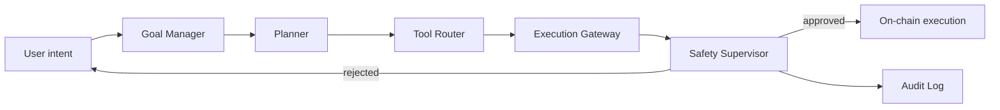

# Ledgr

**An agentic operating layer for crypto wallets.** Users state a goal in natural language; Ledgr plans, validates, and executes the on-chain actions to achieve it — through a guarded pipeline that keeps reasoning, execution, and safety as independent layers.

🔗 **Live demo:** [ledgr-nu.vercel.app](https://ledgr-nu.vercel.app)

---

## Why Ledgr

Crypto wallets today demand that users understand contracts, gas, slippage, approvals, and the failure modes of every protocol they touch. The interface is the bottleneck, not the chain. Ledgr replaces the wallet's command surface with an agent that translates intent into safe, auditable on-chain execution — without removing the user's control over what actually runs.

The hard problem isn't generating transactions from text. It's doing so *reliably and safely* on a substrate where mistakes are irreversible. Ledgr is built around that constraint.

## Architecture

Ledgr is structured as a five-stage pipeline. Each stage has a single responsibility, and no stage can be skipped — the safety supervisor sits between the agent and the chain by design.



- **Goal Manager** — captures and normalizes user intent, tracks multi-step goals, and maintains conversational context across turns.
- **Planner** — decomposes a goal into discrete, verifiable steps. Each step is an explicit action with preconditions and expected post-state.
- **Tool Router** — maps each planned step to the right on-chain capability (transfer, swap, approve, contract call) and prepares the call payload.
- **Execution Gateway** — handles transaction construction, gas estimation, simulation, and signing flow. Idempotent — duplicate requests resolve to the same on-chain action, not a second one.
- **Safety Supervisor** — the gatekeeper. Validates every action against risk policies (value caps, contract allowlists, simulation results, anomaly checks) *before* anything reaches the chain. Rejects with reason; never silently mutates intent.
- **Audit Log** — every plan, decision, and execution is recorded for after-the-fact verification.

This separation is the point. Reasoning can be wrong, planning can be wrong, but the safety supervisor is the last line — and it operates on the executable artifact, not on natural language.

## Tech Stack

- **Frontend & app:** Next.js (App Router), TypeScript, Tailwind CSS, Geist
- **Agent runtime:** Vercel AI SDK for the agent loop, tool calling, and streamed reasoning
- **Web3:** viem and wagmi for EVM interaction, transaction signing, and wallet connection (RainbowKit)
- **Testing:** Vitest
- **Network:** Sepolia testnet
- **Deployment:** Vercel

## Current State

Ledgr is an MVP in active development. Working today:

- Conversational interface with streamed agent reasoning
- Goal Manager → Planner → Tool Router → Execution Gateway → Safety Supervisor pipeline
- Wallet connection and Sepolia transaction execution
- Audit log of agent actions

In progress / next:

- Expanded tool surface (swaps, approvals, multi-step DeFi flows)
- Richer safety policies (per-protocol allowlists, value caps, anomaly detection)
- Transaction simulation pre-flight on every action
- Mainnet support with strict opt-in caps

## Design Decisions

A few choices worth calling out, because they're the parts most agent-on-chain projects get wrong:

**The safety supervisor operates on the prepared transaction, not the natural-language intent.** This is deliberate. A planner can be jailbroken; an executable payload either matches policy or doesn't.

**Idempotency in the execution gateway.** Re-asking for the same action does not produce a second transaction. This sounds obvious until you watch an agent loop retry on a timeout.

**Reasoning is streamed and visible.** The user can see what the agent is about to do *before* the supervisor approves it. Trust comes from legibility, not from claims of safety.

**Sepolia by default.** Real-value handling on mainnet is gated behind explicit configuration. The roadmap moves there with caps and additional supervision, not by flipping a flag.

## Local Development

```bash
git clone https://github.com/O-Midey/ledgr.git
cd ledgr
npm install
npm run dev
```

Open [http://localhost:3000](http://localhost:3000).

You'll need a `.env.local` with:

```
NEXT_PUBLIC_WALLETCONNECT_PROJECT_ID=...
NEXT_PUBLIC_ALCHEMY_RPC_URL=...
OPENAI_API_KEY=...   # or whichever LLM provider
```


Run tests:

```bash
npm run test
```

## Research Foundation

Ledgr's pipeline draws on current work in agentic system reliability — ReAct-style reasoning with explicit verification, structured tool calling, and the principle that safety must be enforced on the executable artifact rather than at the reasoning layer.

## Roadmap

- Mainnet execution with strict opt-in value caps
- Transaction simulation via Tenderly / native eth_call for pre-flight validation
- Multi-protocol tool surface (DEX aggregators, lending, staking)
- Per-tool safety policies with provable invariants
- Optional MCP server interface so the same agent backend can serve other clients

## License

MIT
